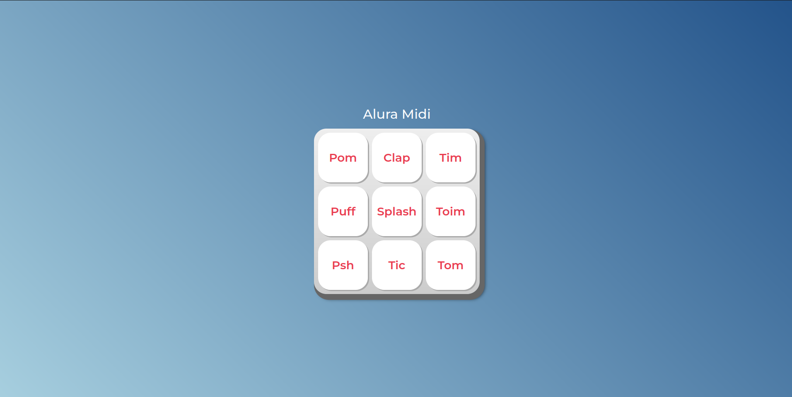

# Alura Mini

O Alura Mini de Teclas de Som é um projeto interativo do curso de formação de front-end ONE T6 da Alura com parceria com a Oracle que visa ensinar a manipulação do DOM usando javascript. Aprendemos neste curso sobre funções declarativas, expressas e anônimas, abordando conceitos fundamentais como, laços de repetição, variáveis, uso de condicionais como o if, template strings, adição e remoção de classes usando JavaScript e trabalhando com listas de classe.

## :dizzy: Tecnologias utilizadas

<div>
  
  
  
</div>

## :computer: Visão Geral do Projeto

### Imagem da Interface do usuário


## :mag: Demonstração

Para uma experiência completa do funcionamento do projeto, você pode acessar a demonstração interativa do Alura-Mini no Github Page: [clicando aqui.](https://charlesbrcosta.github.io/Alura-Mini/)

## :warning: Pré-requisitos

- Navegador web moderno que suporte HTML5, CSS3 e JavaScript.

## :open_file_folder: Como baixar o projeto para o computador e executar

1. Clone o repositório:

   ```bash
   git clone https://github.com/charlesbrcosta/Alura-Mini.git
   cd Alura-Mini

2. Abra o arquivo index.html no seu navegador.

## :paperclip: Contribuição

1. Faça um fork do projeto.
2. Crie uma branch para a sua contribuição (git checkout -b feature/nova-funcionalidade).
3. Faça as alterações necessárias e commit (git commit -am 'Adicionando nova funcionalidade').
4. Push para a branch (git push origin feature/nova-funcionalidade).
5. Crie um novo Pull Request.

## :student: Autor

[<br><sub>Charles Bruno</sub>](https://github.com/charlesbrcosta)
